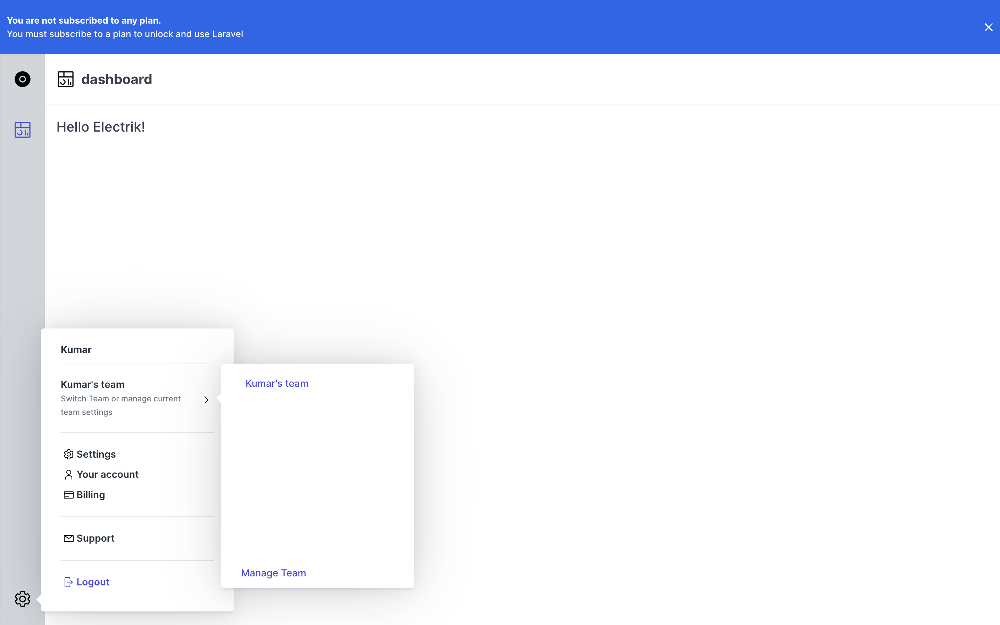

# Electrik

Electrik is a full-featured and open-source stater-kit for for your next SaaS application. It's built on top of Laravel, Livewire, electrik/slate, Tailwind. 

[](https://github.com/electrikhq/electrik/actions/workflows/ci.yml)      

.

Electrik supports:
* Teams
* Subscription Billing via Stripe
* User Management
* User profiles
* Bare-bones Dashboard 
* much more.

## Why another Starter kit?

It's true that there are a lot of starter kits available for SaaS applications. They all have great features. What saperates Electrik from any other start-kit out there is that its 100% open source. Electrik does not have tired pricing or pro features like almost every other start-kit out there provides and then asks for a premium for this. Electrik will always stay open source and free. Even for commerial usage.

## What's the catch?

There is no catch :)

## How to use Electrik?

Electrik is meant to be used on a fresh laravel installation. It does not support integration with existing laravel applications. 

To install electrik to your project, use the following steps:

1. Create a fresh laravel application
```
composer create-project laravel/laravel <awesome-saas-project> --prefer-dist
```

2. Requiire Electrik via composer
```
composer require electrik/electrik
```

3. Install Electrik
```
php artisan electrik:install
```

4. Start Artisan
```
php artisan serve
```

That's all! Now goto [https://localhost:8000/dashboard](https://localhost:8000/dashboard) and enjoy!


## Sponsors

Electrik would not have been possible without our generous sponsors:

* [Netsouls](https://www.studionetsouls.com/)
* [Quick Brown Fox](https://qbf.company/)
